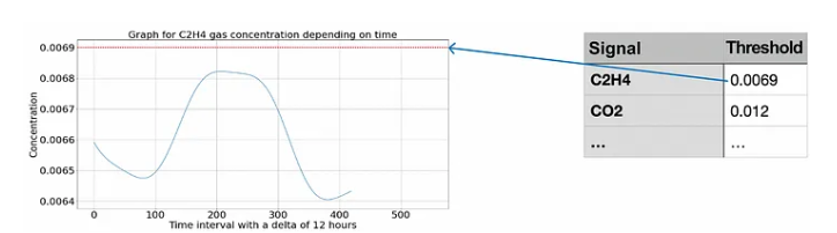
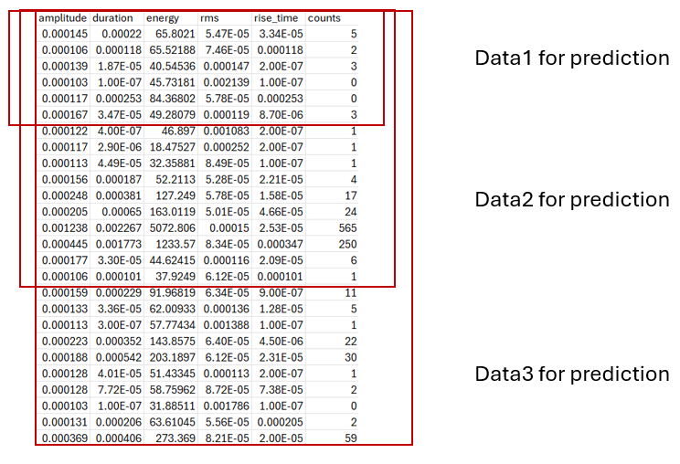

# RUL
In International Standards about condition monitoring and diagnostics of machines, RUL is defined as remaining time before system health falls below a defined failure threshold (or before the system passes into a state in which it needs to be repaired or replaced).

This means that, at each point in time, one can estimate the time left until a critical state, indicated by the red dotted line. The time can be expressed in days, cycles, runs, casts, or some other units, proceeding from the problem statement and available data

## Data
data on equipment operation, i.e., process parameter values, sensor signals for the entire period of operation from the moment of start-up to the moment of failure

data on operation time to failure (i.e., the duration of operation before the failure occurred)

information on thresholds (permissible values) for individual signals or health indicators that point to failure if achieved.

## Approaches to solving the RUL estimation problem
1. Statistical evaluation
In statistical evaluation approach, the time-to-failure distribution function is built on historical data to estimate the RUL of equipment; refer to the figure below.

2. Parameter prediction
In parameter prediction method, the RUL estimation is based on the prediction of parameter values before the threshold is achieved. This approach is also called the degradation model approach, in which there are two main laws of degradation:
Linear degradation: the prediction is presented as a straight line while historical data determine its slope; it is usually applied if the system does not accumulate damage (degradation).
Exponential degradation: the prediction is presented as an exponent; it is usually applied if the system can accumulate damage cumulatively.

3. Regression model
      In this case, we reduce the problem to the classical regression formulation.
 To do this, extract features from time series (process parameters or health indices)
As a result, we obtain a sample of features X, and we also need a sample of responses (time to failure) y. Thus, this approach requires data on equipment operation (process parameters, sensor signals) and data on operation time to failure, and the problem can be solved as a classical regression problem with tabular data

4. Similarity with patterns from previous periods
Another very common approach to RUL estimation, also known as the similarity model, is comparing current operation or condition with historical data. To do that, we can cut previous periods in operation at the same moment in time as the current period.

There are two main options to implement the similarity model:

Direct comparison of time series using proximity metrics 
Selection of features from a time series and further comparison of the obtained feature vectors (i.e., proximity metrics, clustering).

The desired RUL estimation will be the value of the most similar operation period from the history or the average (or any other aggregation) over a group / cluster of operation periods

## Summary

# TEST

We are using mechanical testing data produced in the laboratory by means of a test frame on which we grip a material specimen. A requirement for the test frame is that it can provide to us force and displacement over time. For the Fatigue tests, the Load is the controllable parameter . The Displacement is the uncontrollable parameter, but it is measurable by the system.

## Data COLLECTION

## Approach: data on operation time to failure

# Data description and preprocessing

This dataset has 8 columns. Description of each column is as follows:

Column 1-6: 6 features extracted from sensor measurements
Column 7: Corresponds to cycle number. 
Column 8: Corresponds to specimen number

Target definition: RUL

Training data
training data contains run to failure data of all specimens:
Specimen 1 fails after 3113 cycles. So, at the first cycle of specimen 1, its RUL is 3112. After cycle 2, its RUL is 3111 and so on. As it fails after 3113 cycles, at 3113rd cycle, its RUL is 0. This type of degradation model is called linear degradation model. From the start of the cycle, it decreases gradually to 0 at the last cycle. 
Apart from linear degradation model, there is another degradation model called piecewise linear degradation model that is also widely used. In this model, at the beginning (for a number of cycles), RUL is assigned to a fixed number. The fixed number is called early RUL. When RUL value reaches early RUL, from there on RUL follows a linear degradation model
To illustrate both degradation model, we will plot RUL values for engine 1 using both models. RUL of specimen 1 is 3113. For piecewise linear degradation model, we take early RUL to be 1000 (It's just a choice. There is no definite rule for selecting this value).

Testing data
Test data are similar to train data with only one difference. While for training data, data are available until failure for each specimen, for test data, it is available for an arbitrary number of cycles. Using the given test data, our goal is to predict RUL. For test data, true RUL values are also available so that we can compare the performance of our prediction algorithm.

Preparing data for training algorithm
We will only use columns 1-6 values to train our algorithm as those are sensor measurements
An algorithm generalizes well (i.e., its performance on unseen data is good) if unseen data is similar in distribution to training data. Unseen data need not be exactly of same distribution as of training data, but it should not be very different from training data.
Here, we will just check the distribution of training and test data. It should be noted that test data should never be used while training an algorithm. Training an algorithm is an iterative process. With more parameters, it is very likely that training error reduces nearly zero. But its performance on new unseen data is not that good. In that case, we say that the model has overfit the training data (or memorized the training examples). Therefore, while training we have to devise some way to check whether the model is learning something or just memorizing the training data.
Here, we will only show the density plot of training as well as test data:

While preparing data for a training algorithm, we must consider several factors:
Should data be scaled? If data are scaled, should a single scaling be applied to all specimens or individual scaling be applied for every specimen?
Should linear degradation model or piecewise linear degradation model for RUL be used? If piecewise linear degradation model is used, what is the value of early RUL?
 We choose to apply scaling individually to every specimen.
For some applications, we consider each row of the data matrix as a data point and our training model is trained accordingly. But for some other applications, we use a window of data. There may be overlap between windows.

Test data preprocessing

For each specimen in the test set, we need to predict one RUL value. To predict one RUL value, we need one example of test data for each specimen. So, the obvious choice is to use the last example of test data for each specimen. If an example consists of a window of data, for a given window length, we will take the last window of data that can be extracted from test set for a particular specimen.

The above approach, though technically correct, is prone to mistakes. What happens if the measurements of last example have some outliers? In that case our prediction would be way off. One approach to circumvent this issue is to take, say, last 5 examples instead of only the last example for each engine. Then we will get 5 RUL prediction values. We can average those to come up with our final estimate of RUL. In this way our RUL estimate will be a little conservative but robust against outliers in the last test example

In our case, the test dataset contains only one specimen, but we used it to create 3 ‘Specimens’ with decreasing RUL for better visualization and result analysis.

models to deploy

RNNs : LSTM
                   GRU

CNNs: 1DCNN
                TCNN

# Training process

Data normalization for real time deployment

Hyperparameters finetuning and model evaluation

